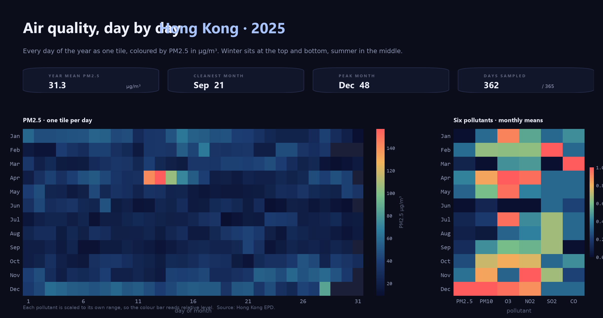

# airquality-daily-hongkong

Every day of 2025 as one tile — twelve months down, thirty-one days across,
coloured by how much PM2.5 was in the air.



**[Interactive version](https://Yawnz2ZN.github.io/airquality-daily-hongkong/)**
— scrub the months, hover a square for the raw number.
# The phenomenon


## The phenomenon
Fine particulate matter under 2.5 micrometres: small enough to hang in the air for
days and to reach the lungs, and invisible when it is bad. It is not spread evenly
over the year — it rides the monsoon. Winter brings continental air down from the
north and the level climbs; summer brings rain, which washes it out.

## The source

Hong Kong Environmental Protection Department, hourly pollutant concentrations:
<https://www.aqhi.gov.hk/en/download/past-24-hours-pollutant-concentration.html>

`fetch.py` asks once and writes the reply to `data/hongkong-air-quality.csv`
exactly as it arrived — unchanged, committed, no key, no login. The file holds
4,645 rows covering 2014 to 2026; `airq.py` takes the 2025 slice and parses it to
one row per day. It prints the first row, one value and that value's `type()`
before anything is drawn — the CSV arrives as text, and a plot built from strings
is empty and silent.
## What the picture shows

<!-- Two or three sentences. Including what it hides: every transformation throws
something away, and naming what yours threw away is the easiest way to sound like
you know what you did. -->

## Run it

```
uv run fetch.py
uv run plot.py
```
